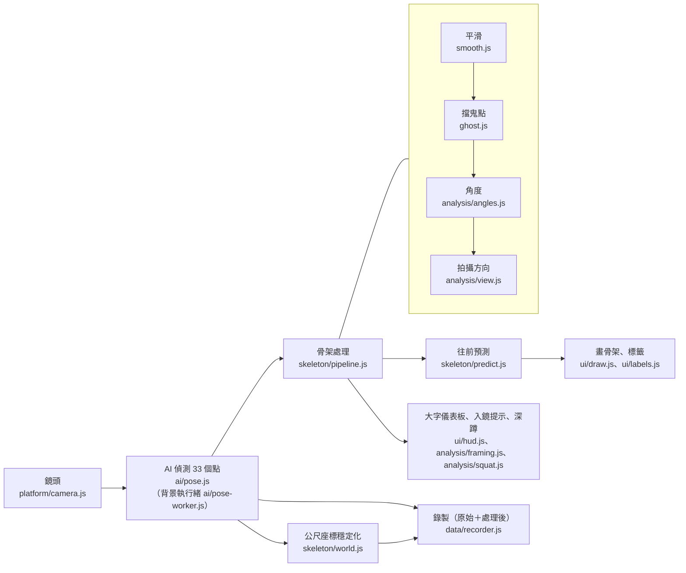

# 程式架構

這份文件說明整個網站的程式怎麼分工：每個資料夾負責什麼、鏡頭的一格畫面會經過哪些程式，以及怎麼測試。第一次看程式碼，建議先讀這份。

## 一、設計原則

1. **影像不離開裝置**：AI 在使用者自己的手機或電腦上執行，沒有伺服器，鏡頭影像不會上傳。錄製的只有關鍵點座標，而且只會存成使用者自己下載的檔案。
2. **不需要安裝、不需要編譯**：純 HTML、CSS、JavaScript（ES 模組），直接放在 GitHub Pages 上就能用。沒有打包工具，原始碼就是實際執行的程式。
3. **一個檔案只做一件事**：例如 `smooth.js` 只負責平滑、`angles.js` 只負責算角度。要改某個功能時，只需要看一個檔案。
4. **畫面與計算分開**：計算的程式（`skeleton/`、`analysis/`、`data/`）不碰畫面，可以直接拿來測試，鏡頭頁和重播頁也共用同一份。
5. **原始資料永遠保留**：平滑、擋鬼點都只影響畫面上畫的東西；錄製檔同時存原始資料和處理後的資料，之後換方法時不用重錄。
6. **註解寫原因**：每個檔案開頭說明它的用途，數字門檻旁邊寫「為什麼是這個數字」，以及是用什麼測試、模擬決定的。

## 二、資料夾

```
claude-workspace/
├── index.html          首頁＋鏡頭畫面
├── replay.html         錄製資料重播分析
├── help.html           使用說明
├── sw.js               離線功能（Service Worker；瀏覽器規定要放在網站最外層）
├── css/
│   ├── style.css       全站共用的樣式（三頁共用的導覽列、首頁、鏡頭畫面、使用說明）
│   └── replay.css      重播分析頁專用的樣式
├── js/
│   ├── config.js       全站設定：MediaPipe 版本、模型位置、網址參數
│   ├── pages/          每一頁的主程式：把下面的模組組合起來、處理按鈕
│   ├── ai/             AI 模型：載入 MediaPipe、在背景執行緒偵測骨架
│   ├── skeleton/       骨架處理：平滑、擋鬼點、往前預測、公尺座標穩定化
│   ├── analysis/       動作判斷：關節角度、拍攝方向、入鏡提示、深蹲次數
│   ├── ui/             畫面元件：骨架、標籤、大字儀表板、數據表、曲線圖
│   ├── platform/       裝置功能：鏡頭、螢幕保持亮著、離線、GPU、裝置支援檢查
│   └── data/           錄製與重播：匯出 CSV／JSON、讀檔重算、合成示範資料
├── tests/              自動測試（node --test tests/）
├── docs/               文件（這份、資料格式、設計規劃、日後改進）
└── .github/workflows/  自動化：發布網站、每次推送時跑測試
```

### 每個檔案

| 資料夾 | 檔案 | 負責 |
|---|---|---|
| `pages/` | `main.js` | 鏡頭頁：開關鏡頭、每一格的流程、工具列、數據面板、錄製（含倒數） |
| | `replay.js` | 重播分析頁：選檔、曲線圖、統計、3D 檢查、匯出角度 CSV |
| | `help.js` | 使用說明頁：「檢查這支手機」 |
| | `hero-art.js` | 首頁的深蹲動畫 |
| `ai/` | `pose.js` | 載入 MediaPipe 與模型（兩個下載來源、逾時重試）、選 GPU 或 CPU、背景執行緒當掉時自動重啟 |
| | `pose-worker.js` | 背景執行緒：在這裡跑 AI，主畫面不會卡 |
| | `fps.js` | 計算每秒偵測幾格 |
| `skeleton/` | `pipeline.js` | 處理流程的總管：每一格依序呼叫平滑 → 擋鬼點 → 角度 → 拍攝方向 |
| | `landmarks.js` | 33 個關鍵點的名稱、哪些是主要關節、看不看得到 |
| | `smooth.js` | One Euro Filter 平滑：靜止時不抖、動作快時跟得上 |
| | `ghost.js` | 擋掉 AI 腦補出來的點與「人走了還留著」的鬼骨架 |
| | `predict.js` | 往前預測：補償 AI 計算的時間，骨架不會拖在身體後面 |
| | `world.js` | 公尺座標穩定化：平滑＋骨頭長度限制 |
| `analysis/` | `angles.js` | 關節角度（膝、髖、肘），肢體太短時不給角度 |
| | `view.js` | 判斷側面、斜側面、正面拍，以及面向哪一邊 |
| | `framing.js` | 入鏡提示（請往後退、請站到中間…），不會一直閃 |
| | `squat.js` | 深蹲次數與深度（實驗中，`?lab=squat`） |
| `ui/` | `draw.js` | 在畫布上畫骨架 |
| | `labels.js` | 關鍵點的編號標籤、點一下看名稱 |
| | `hud.js` | 站遠也看得到的大字儀表板 |
| | `datapanel.js` | 數據面板的數值表格 |
| | `chart.js` | 重播頁的角度曲線圖 |
| `platform/` | `camera.js` | 開關鏡頭、列出鏡頭、判斷前後鏡頭 |
| | `screen.js` | 運動時讓螢幕保持亮著（Wake Lock） |
| | `offline.js` | 註冊離線功能（`sw.js`），`?sw=0` 可移除 |
| | `gpu.js` | 查詢 GPU 名稱 |
| | `support.js` | 這支手機能不能用（WebGL2、相機、系統版本） |
| `data/` | `recorder.js` | 錄製：每一格的原始與處理後資料，匯出 CSV、JSON |
| | `replay-core.js` | 重播的計算核心：讀檔、用和鏡頭頁相同的流程重算 |
| | `replay-worker.js` | 重播的背景執行緒 |
| | `synth.js` | 合成示範資料（3D 火柴人做深蹲），測試與示範用 |

## 三、一格畫面的流程

鏡頭每一格畫面，從拍到畫出來會經過這些程式（`pages/main.js` 負責串起來）：



重點：

- **角度、深蹲判斷、錄製都用沒有預測的數字**，預測只影響畫出來的位置。
- **錄製檔保留 AI 的原始輸出**，處理後的資料另外存一份（欄位在後面），格式見 [data-format.md](data-format.md)。
- **重播分析頁**（`data/replay-core.js`）把錄製檔一格一格丟進**同一個** `skeleton/pipeline.js`，結果和當下鏡頭畫面完全相同，所以可以用錄影檢查判斷得對不對。

## 四、執行緒

| 執行緒 | 做什麼 | 為什麼 |
|---|---|---|
| 主畫面 | 按鈕、畫骨架、平滑與判斷（每格約 1 毫秒） | 要碰畫面的工作只能在這裡 |
| AI 背景執行緒（`ai/pose-worker.js`） | 跑 MediaPipe（每格 20～60 毫秒） | 最重的工作移出去，按鈕、動畫不會卡；不支援的瀏覽器自動改在主畫面跑 |
| 重播背景執行緒（`data/replay-worker.js`） | 讀檔、重算整段錄影 | 5 分鐘的檔案在手機上要算好幾秒，畫面不會凍住 |
| Service Worker（`sw.js`） | 存 AI 檔案，第二次打開不用下載、沒網路也能用 | 18 MB 的 AI 檔案每次重新下載太慢 |

## 五、怎麼測試

**自動測試**（不需要瀏覽器、不用安裝套件，約 2 秒）：

```
npm test
```

| 檔案 | 測什麼 |
|---|---|
| `tests/skeleton.test.mjs` | 平滑真的變穩、壞掉的數字不會擴散、亂七八糟的輸入不會當掉；公尺座標穩定化更接近真實位置，而且骨頭長度限制比只做平滑更準 |
| `tests/analysis.test.mjs` | 角度計算、深蹲次數與深度、正面拍不計算、小幅晃動不誤算 |
| `tests/data.test.mjs` | CSV／JSON 格式、讀 JSON 和讀 CSV 結果相同、壞掉的檔案給中文錯誤、3D 檢查 |
| `tests/platform.test.mjs` | 從瀏覽器識別字串判斷 iPhone、Android、LINE 內建瀏覽器 |

每次推送到 GitHub 時，`.github/workflows/test.yml` 會自動跑一次，結果在 GitHub 的 Actions 頁面。

**測試真的抓得到錯誤嗎？** 我們故意把程式改壞，確認測試會失敗：

| 故意放進去的錯誤 | 測試抓到 |
|---|---|
| 平滑關掉 | ✓ |
| 深蹲「蹲下去」的門檻改錯 | ✓ |
| 匯出的 CSV 少一欄 | ✓ |
| iOS 17.5 被讀成 17.05（以前真的發生過） | ✓ |
| 骨頭長度往反方向修、修正失效 | ✓ |
| 拿掉「深度方向明確才修」（以前試過、比較差的做法） | ✓ |

**瀏覽器端測試**：開發時另外用 Playwright（自動操作瀏覽器的工具）配合假鏡頭，測過開關鏡頭、錄製、匯出、重播、離線、手機版面、背景執行緒當掉恢復等上百種情境。這些測試要先在電腦上準備好 MediaPipe 和瀏覽器才能跑，所以沒有放進專案裡；測過的情境與結果記錄在各 PR 的說明裡。

**真人、真手機的驗證**：見使用說明頁的「驗證實驗」，以及 [roadmap.md](roadmap.md) 的「要等真人、真手機才能確認的事」。

## 六、常見的修改要改哪裡

| 想做的事 | 改哪裡 |
|---|---|
| 換 MediaPipe 版本或模型 | `js/config.js`，以及 `sw.js` 裡的版本號和 `AI_CACHE` 名稱 |
| 調整平滑程度 | `js/skeleton/smooth.js` 開頭的數字（旁邊有每個數字的意思） |
| 多算一個關節角度 | `js/analysis/angles.js` 的 `ANGLES` |
| 新增一種動作（例如伏地挺身） | 仿照 `js/analysis/squat.js` 新增一個檔案，在 `js/pages/main.js` 和 `js/data/replay-core.js` 呼叫 |
| 錄製檔多存一個欄位 | `js/data/recorder.js`（加在最後面，舊的分析程式才不用改），並更新 `docs/data-format.md` |
| 改顏色、版面 | `css/style.css` 最上面的顏色設定（`:root`） |

## 七、發布

推送到 `main` 分支後，`.github/workflows/deploy.yml` 會自動發布到 GitHub Pages（約 1 分鐘）。發布時會在每個 JS、CSS 檔名後面加上版本號（例如 `main.js?v=1a2b3c4d`），手機才不會用到「新舊混在一起」的檔案。
